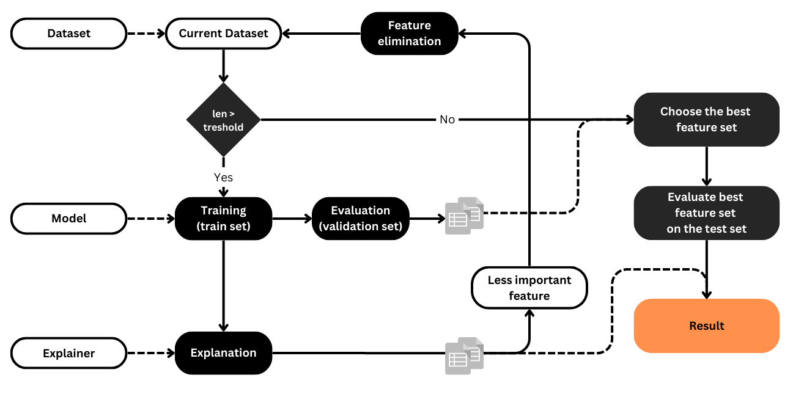

    

## Description
This repository aims to provide tools for comparing different explainability methods, enhancing the interpretation of machine learning models. It currently includes demonstrations of SHAP and LIME, with the intention of expanding to include more interpretability techniques in the future.

### SHAP
- SHAP values provide global interpretations of a model's output by attributing each feature's contribution to the predicted outcome.
- The script initializes a RandomForestRegressor model and explains its global behavior using SHAP.

### LIME
- LIME provides local interpretations of individual predictions by approximating the model's behavior around specific data points.
- The script initializes a LimeTabularExplainer and explains local predictions of the RandomForestRegressor model using LIME.

## Comparison techniques

## Feature selection

    

## Status
This repository is under construction. Additional features and interpretability methods will be added in future updates.

## Call for Contributors
We're seeking individuals with expertise in machine learning, preferably explainable artificial intelligence (XAI), and proficiency in Python programming. If you have a background in these areas and are passionate about enhancing machine learning model transparency, we welcome your contributions. Join us in shaping the future of interpretable AI.

## File Structure
- `main.py`: Main Python script demonstrating the usage of SHAP and LIME for model interpretability.
- `LIME.py`: Wrapper class for LIME explanations.
- `SHAP.py`: Wrapper class for SHAP explanations.

## License
This project is licensed under the MIT License - see the [LICENSE](LICENSE) file for details.

## Acknowledgments
- The California housing dataset is sourced from scikit-learn.
- SHAP and LIME libraries are used for model interpretability.
