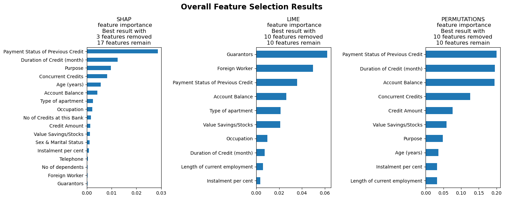
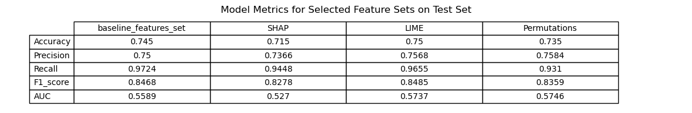
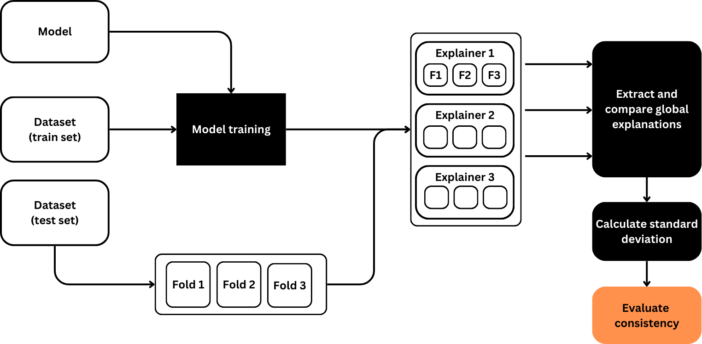
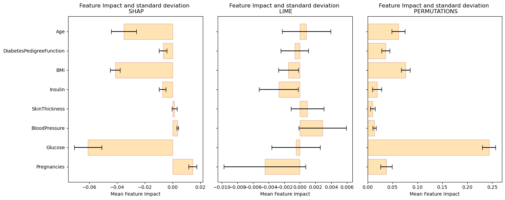
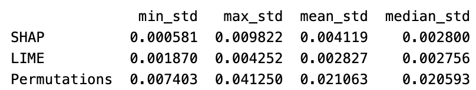
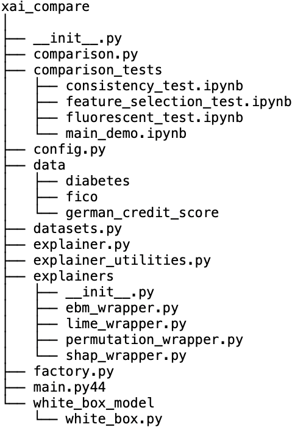

<div align="center">
    
</div>

---
[](https://pypi.org/project/)

[](https://pypi.org/project/)


## Description
The xai-compare package provides a comprehensive framework for comparing various Explainable AI (XAI) techniques. It supports popular XAI methods such as SHAP, LIME, and Permutation Feature Importance, and introduces comparison techniques like consistency measurement and feature selection analysis. This package is designed for flexibility and ease of integration, making it ideal for enhancing model transparency and model results.


## Installation

The package can be installed from [PyPI](https://pypi.org/project/):

Using pip:
```bash
pip install shap
```

## Explainers

Currently the package provides the usage of three model agnostic XAI methods:
SHAP, LIME, and Permutation Feature Importance.

### SHAP
- SHAP values provide global interpretations of a model's output by attributing each feature's contribution to the predicted outcome.
- Depending on the model type, the script initializes an appropriate explainer such as shap.TreeExplainer for tree-based models, shap.LinearExplainer for linear models, or shap.KernelExplainer for more general models. It then uses SHAP to analyze and explain the behavior of the model.

### LIME
- LIME provides local interpretations of individual predictions by approximating the model's behavior around specific data points.
- The script initializes a LimeTabularExplainer and explains local predictions of the model using LIME.

### Permutation Feature Importance
- Permutation Feature Importance assesses the impact of each feature on a model’s prediction by measuring the decrease in the model’s performance when the values of a feature are randomly shuffled.
- The script measures this dependency by calculating the decrease in model performance after permuting each feature, averaged over multiple permutations.


## Comparison techniques

### Feature selection

The FeatureSelection class provides a robust tool for optimizing machine learning models by identifying and prioritizing the most influential features. This class leverages a variety of explainers, including SHAP, LIME, and Permutation Importance, to evaluate feature relevance systematically. It facilitates the iterative removal of less significant features, allowing users to understand the impact of each feature on model performance. This approach not only improves model efficiency but also enhances interpretability, making it easier to understand and justify model decisions.

<div align="center">
    
    <p style="color: #808080;">Feature Selection Workflow</p>
</div>


```
from sklearn.ensemble import RandomForestClassifier

from xai_compare.comparison import FeatureSelection
from xai_compare.config import MODE
from xai_compare.datasets import german_credit

# define the model
model = RandomForestClassifier(max_depth=4, n_estimators=100, random_state=42)

# create the FeatureSelection class with german_credit() dataset
feat_selection = FeatureSelection(model, *german_credit(), mode=MODE.CLASSIFICATION)

feat_selection.apply()
feat_selection.display()
```

<div align="center">
    
</div>
<div align="center">
    
</div>

### Consistency
The Consistency class assesses the stability and reliability of explanations provided by various explainers across different splits of data. This class is crucial for determining whether the insights provided by model explainers such as SHAP, LIME, and Permutation Importance are consistent regardless of data variances. By systematically evaluating the explainers across multiple data folds, the Consistency class helps ensure that the interpretations are robust and can be trusted. It includes features for both visualizing and quantitatively measuring the consistency of feature impact, making it an essential tool for model validation and understanding in various scenarios, from healthcare to finance.

<div align="center">
    
    <p style="color: #808080;">Consistency Measurement Workflow</p>
</div>

```
from sklearn.ensemble import RandomForestClassifier

# Local application imports
from xai_compare.comparison import Consistency 
from xai_compare.datasets import diabetes
from xai_compare.config import MODE

# Initialize and train a Random Forest classifier
model = RandomForestClassifier(max_depth=4, n_estimators=100, random_state=42)

# create the Consistency class with diabetes() dataset
consistency = Consistency(model, *diabetes(), mode=MODE.CLASSIFICATION) 

consistency.apply()
consistency.display()
```

<div align="center">
    
</div>
<div>
    
</div>

## Sample notebooks
The notebooks below demonstrate different use cases for xai_compare package. For hands-on experience and to explore the notebooks in detail, visit the notebooks directory in the repository.

[Feature Selection Test Notebook](
xai_compare/comparison_tests/feature_selection_test.ipynb)

[Consistency Test Notebook](
xai_compare/comparison_tests/consistency_test.ipynb)

[Main Demo Notebook](
xai_compare/comparison_tests/main_demo.ipynb)


## Call for Contributors
We're seeking individuals with expertise in machine learning, preferably explainable artificial intelligence (XAI), and proficiency in Python programming. If you have a background in these areas and are passionate about enhancing machine learning model transparency, we welcome your contributions. Join us in shaping the future of interpretable AI. 

## File Structure
<div>
    
</div>

## License
This project is licensed under the MIT License - see the [LICENSE](LICENSE) file for details.

## Acknowledgments
- The California housing dataset is sourced from scikit-learn.
- SHAP and LIME libraries are used for model interpretability.
